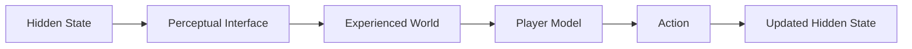
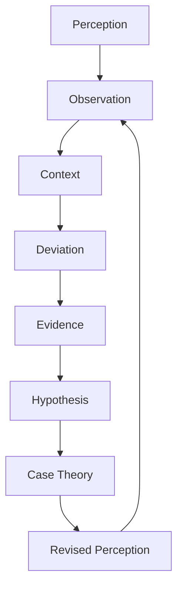
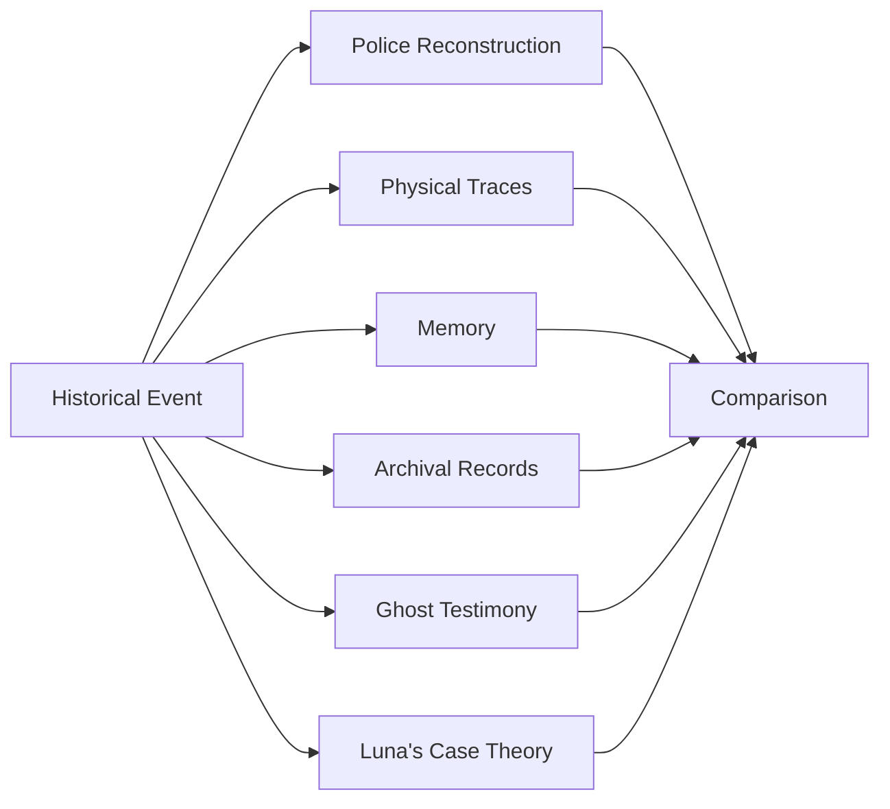

# Luna's Dead

## Perception, Evidence, Memory, and the Architecture of an Interactive Afterlife

**Luna's Dead** is an evolving interactive story world and art–technology experiment about perception, memory, evidence, love, death, and the instability of what appears to be real.

At its center is Luna, an attorney who survives a near-death event and begins perceiving contradictions between the ordinary world and another representational layer associated with the dead.

This repository documents the **public research, design systems, experiments, diagrams, and selected prototypes** behind the project.

It is intentionally **not** the complete story bible.

Private character histories, unreleased scripts, the complete historical mystery, future series arcs, and other protected canon are maintained separately.

---

## The Working Question

> **When every observer sees through an interface, how do we decide what deserves to be believed?**

Luna's Dead treats this question as a game-design problem rather than simply a theme.

The player does not receive direct access to a final objective state.

Instead:



A document may express an institution's reconstruction.

A memory may be sincere and wrong.

A physical trace may contradict the official record.

A ghost may know less than the living assume.

An object may become important because it does not belong where it appears.

The player's task is therefore not merely to collect clues.

It is to **build and revise models under uncertainty**.

---

# Two Theoretical Starting Points

The project currently uses two bodies of thought as generative frameworks.

## Donald Hoffman — Perception as Interface

Cognitive scientist Donald Hoffman's Interface Theory of Perception proposes, in simplified terms, that perception need not provide a literal reconstruction of objective reality. Perception can instead be understood as an adaptive interface.

Luna's Dead translates that concept into game architecture:

```text
underlying state
        ↓
observer-specific transformation
        ↓
experienced environment
```

The game does **not** present Hoffman's broader metaphysical claims as settled scientific fact. The theory is being used as a design instrument.

[Read the perception-system notes →](docs/theory/perception-as-interface.md)

## Óscar Olea — Value, Context, Information

Mexican architect, artist, and theorist **Óscar Olea** explored systematic approaches to artistic criticism, including axiological, contextual, and information-oriented questions.

Luna's Dead borrows a different design principle from this work:

> significance can arise from the relationship between an object and the system of expectations surrounding it.

In the game, the player first learns the grammar of a space.

Then the space violates that grammar.

The violation becomes information.

[Read the axiological-system notes →](docs/theory/olea-value-information.md)

---

# From Theory to Mechanics



This loop informs several systems.

### Perception Layers

The same underlying object can be rendered differently through:

- ordinary living perception;
- Luna's in-between state;
- institutional reconstruction;
- memory;
- ghost perception;
- Veil systems;
- ritual / relational perception.

### Case Theory

The player distinguishes:

- observation;
- evidence;
- inference;
- contradiction;
- hypothesis;
- conclusion.

The game should reward epistemic restraint.

### Information Value

A familiar object in the expected place may carry little new information.

An object that violates the established system may carry much more.

Conceptually:

```text
I(x) = -log2 P(x)
```

This is an inspiration for clue-weighting, not an assertion that narrative truth can be reduced to a formula.

### Memory Networks

Names, photographs, objects, places, stories, rituals, and witnesses can form relational networks.

An **ofrenda** is therefore treated as more than visual decoration.

It becomes a model for how identity persists through relationships.

---

# The Seven Spaces

The world is currently organized around seven major experiential spaces.

| Space | Design Question |
|---|---|
| **Merry Scary** | What is an object? |
| **Memorial** | How does memory assign value? |
| **Zephyr's Garage** | What happens when evidence and representation diverge? |
| **Veil** | Can perceptual systems be engineered? |
| **Deep Downtown** | Is spatial continuity itself an interface? |
| **Palacio** | Can multiple representations coexist? |
| **Ofrenda** | Does meaning emerge through relationships? |

[Read the Seven Spaces overview →](docs/world/seven-spaces.md)

---

# Experimental Mystery: The Room Doesn't Fit

One early playable investigation takes place in a preserved 1980s motorcycle garage.

The environment contains overlapping representations:



The representations cannot all be reconciled.

The player's first meaningful conclusion is intentionally limited:

> **OFFICIAL ACCOUNT INCOMPLETE**

There is no omniscient flashback telling the player exactly what happened.

[Read the investigation-system notes →](docs/systems/the-room-doesnt-fit.md)

---

# Objects as Story, Game, Gallery, and Product

Luna's Dead is being designed as a transmedia world in which a physical object can move through several contexts:


For example, a character's riding jacket might simultaneously become:

- character history;
- visual storytelling;
- evidence;
- a digital game asset;
- wardrobe for a film adaptation;
- an installation object;
- a physically produced garment.

This is different from adding conventional merchandise after a story is complete.

The physical object can help **create the canon itself**.

[Read the collaboration framework →](COLLABORATION.md)

---

# Research / Development Areas

Current experiments include:

- observer-specific state rendering;
- evidence graphs;
- uncertainty and probability;
- environmental anomalies;
- information weighting;
- memory networks;
- UV / black-light interaction;
- first-person environmental storytelling;
- archival interfaces;
- Case Theory;
- Ghost Calls;
- fictional commerce;
- fashion and physical-object collaboration;
- game / film / gallery interoperability.

The game is being developed in **Godot**.

---

# Public vs. Private Development

This public repository is a laboratory.

It may contain:

- theory notes;
- architecture diagrams;
- selected game-system descriptions;
- selected screenshots;
- public prototypes;
- design experiments;
- research notes;
- development journals.

It deliberately does **not** contain:

- the complete story bible;
- full character biographies;
- complete mystery solutions;
- unreleased screenplay material;
- confidential collaboration materials;
- future episode / season plans;
- private business terms.

---

# Collaboration

Luna's Dead is open to **defined collaborations**, not open-universe authorship.

Potential areas include:

- fashion;
- motorcycles;
- visual art;
- photography;
- film;
- sound;
- music;
- jewelry;
- prop making;
- immersive installation;
- performance;
- architecture / environments.

Collaborators work within a defined scope.

Participation in a project does not by itself convey ownership of the pre-existing Luna's Dead world, characters, series, or other background IP.

See [COLLABORATION.md](COLLABORATION.md).

---

# Research Status

This repository discusses contested philosophical and scientific ideas.

References to consciousness, perception, information, spacetime, or metaphysics should be understood as **research and artistic inspiration**, not declarations that contested theories have been scientifically established.

The goal is to ask:

> What happens when we make these questions playable?

---

# Rights

© 2024–2026 Emma D. Enriquez. All rights reserved.

The Luna's Dead story world, characters, dialogue, artwork, scripts, narrative material, fictional organizations, and other original creative expression are not released under an open-content license merely because selected project materials appear in this repository.

No software license is granted unless an individual directory or file expressly provides one.

See [NOTICE.md](NOTICE.md).

---

# Current Status

**October 2026 — active development**

This repository is intended to evolve as a visible record of the project's artistic and technical research.
