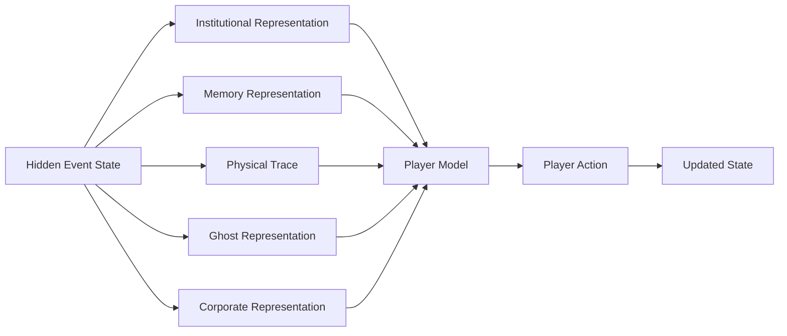

# Development Note 001 — Why Luna's Dead Is Being Built as an Interface System

**Date:** October 2026  
**Status:** Working note

Luna's Dead is not being designed as a story with game mechanics added afterward.

The design problem is the story.

The central question is:

> When every observer sees through an interface, how do we decide what deserves to be believed?

That question affects how the player sees environments, interprets evidence, evaluates testimony, and forms conclusions.

## 1. The player does not receive a truth layer

Many mystery games eventually reveal the correct version of events through an omniscient cutscene or solved-case screen.

Luna's Dead is experimenting with a different structure.

The player receives representations.

These may include:

- physical evidence;
- police reconstruction;
- memory;
- ghost testimony;
- archival records;
- corporate data;
- ritual objects;
- environmental anomalies.

The game can maintain a hidden state, but the player should rarely receive direct access to it.



## 2. Hoffman becomes a rendering problem

Donald Hoffman's Interface Theory of Perception is useful here as a design provocation.

If perception functions like an interface rather than a transparent window, then the same underlying state can be rendered differently depending on the observer.

For Luna's Dead, this allows a single event to support multiple experienced worlds.

That gives us a useful technical distinction:

```text
state != rendering
```

That distinction can drive:

- alternate object appearances;
- memory overlays;
- ghost perception;
- institutional reconstructions;
- visual contradictions;
- Deep Downtown;
- Luna's changing perceptual state.

The goal is not to prove Hoffman's metaphysics.

The goal is to build a playable system from the question.

## 3. Olea becomes an environmental-information problem

Óscar Olea's work is useful in a different way.

A player cannot recognize an anomaly until the environment establishes an expectation.

So the room must teach the player its grammar.

A preserved biker garage might establish:

- tools;
- oil;
- leather;
- old electrical systems;
- analog media;
- motorcycle parts;
- improvised furniture;
- club photographs.

A single object that violates that grammar can become highly informative.

The mechanic is not:

> unusual object = truth.

It is:

> unusual object = reason to revise the model.

This difference matters.

## 4. Case Theory is the bridge

The Case Theory system should become the bridge between perception and judgment.

The player should be able to distinguish:

- **Observation** — what was perceived.
- **Evidence** — an observation relevant to a disputed question.
- **Inference** — what the observation may imply.
- **Hypothesis** — a structured possible explanation.
- **Contradiction** — two representations that cannot both be accepted as currently understood.
- **Conclusion** — a proposition supported strongly enough to act upon.

This structure is particularly important because Luna is an attorney.

Her professional training is not discarded when she encounters the supernatural.

It becomes the method by which she survives it.

## 5. The first lesson: restraint

The early garage investigation is therefore designed around a deliberately limited conclusion:

> **OFFICIAL ACCOUNT INCOMPLETE**

That is not a weak result.

It is a disciplined one.

The player has demonstrated that the accepted reconstruction fails without pretending to know the entire hidden history.

That is the kind of reasoning Luna's Dead should reward.

## 6. Why this matters beyond the game

The same architecture can extend into:

- film;
- gallery installation;
- fashion;
- physical artifacts;
- fictional archives;
- retail environments.

A jacket can be costume, evidence, product, and memory object.

A photograph can be artwork, archive, clue, and unreliable representation.

A room can be a set, a playable level, and a gallery installation.

This is why Luna's Dead is being developed as a story world rather than only as a single executable game.

## Working Principle

The current design principle is:

> **Do not reveal the truth merely because the player has progressed. Change what the player is capable of seeing, comparing, and believing.**
