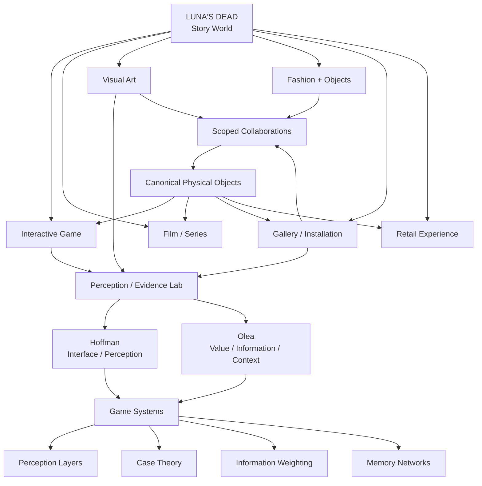

# Luna's Dead — Public Architecture

## Boundary

The public repository documents the research and systems architecture.

The private repository preserves unreleased canon, complete character histories, story solutions, and confidential collaboration material.
