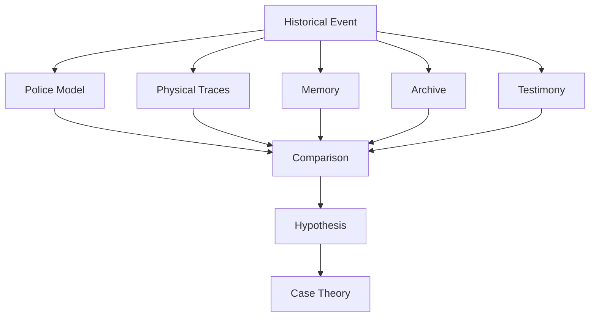

# The Room Doesn't Fit

## Experimental Investigation System

An early playable mystery is set in a preserved motorcycle garage.

The design goal is not:

> Find five glowing clues and unlock the answer.

Instead:

> Learn the room well enough to recognize when the room contradicts itself.

## Layers

## Epistemic Restraint

The system distinguishes:

- observation;
- inference;
- hypothesis;
- conclusion.

The first major conclusion is intentionally:

> **OFFICIAL ACCOUNT INCOMPLETE**

That conclusion matters because it demonstrates that the player can make progress without pretending to possess complete truth.
