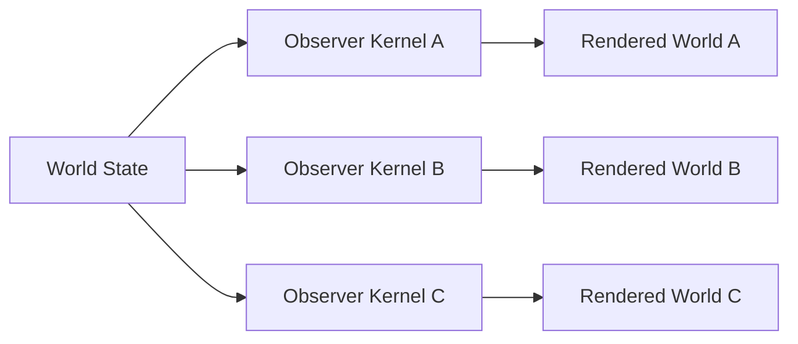

# Perception as Interface

## Design Use

Luna's Dead uses Donald Hoffman's Interface Theory of Perception as a **design provocation**.

The useful question is not whether the game can prove a metaphysical theory.

It is:

> What mechanics become possible if an experienced world is treated as an interface rather than as direct access to the underlying game state?

## Architecture

The same underlying event can therefore produce different experiences.

## Design Consequences

The game can distinguish:

- state from appearance;
- evidence from interpretation;
- testimony from omniscience;
- memory from recording;
- rendering from truth.

A ghost does not automatically know what objectively happened.

Luna does not receive a supernatural truth mode.

The player must compare interfaces.

## Research Caution

Hoffman's Interface Theory of Perception and Conscious Realism remain debated theoretical frameworks.

This project uses them as artistic and computational inspiration rather than presenting their strongest metaphysical implications as established science.
